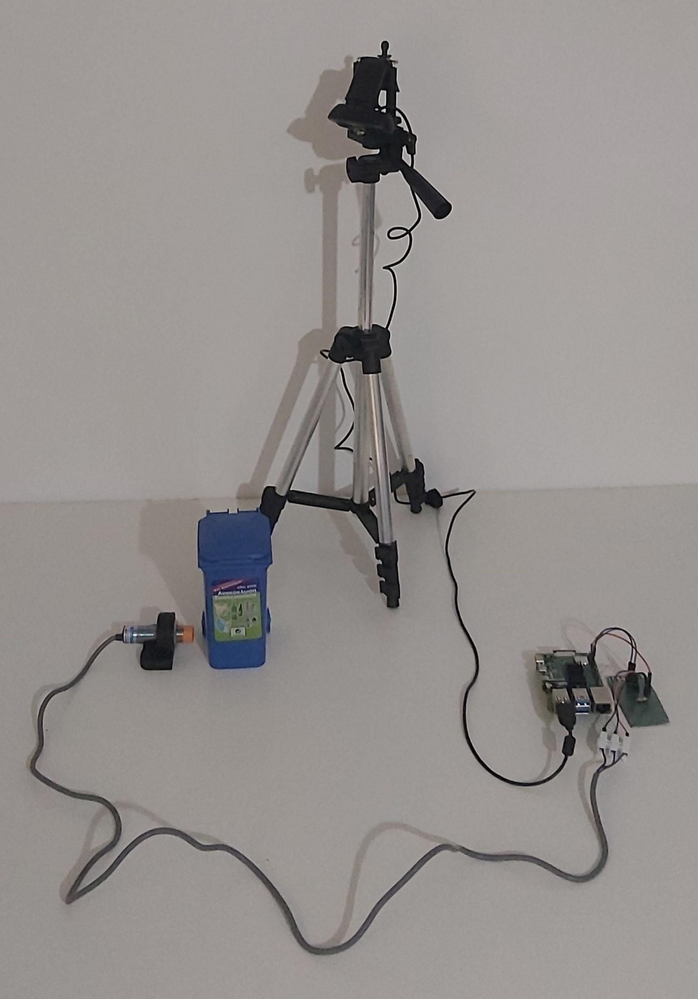

# 
 WASTE SEGREGATION PROJECT 

The waste segregation project is a prototype of a system developed for the identification and classification of recyclable materials using heterogeneous sensors. At it's current state, the system employes 2 sensors, an inductive proximity sensor and a high definition web camera.
The inductive proximity sensor is being used to detect metallic objects and the camera is working alongside a machine learning model to detect objects in the following 5 categories:

- PET
- HDPE
- PP
- PS
- METAL

User can interract with the system using a friendly UI developed with streamlit.

**Demo Video:**

## Main Components

- Raspberry Pi model 4B
- Inductive Proximity Sensor
- Logitech HD Webcam

## Steps to reproduce

To reproduce the hardware of the system you can follow the schematics in the dedicated folder named docs.

To reproduce the software of the system see the following steps:

1. Install the project with git pull
2. Install dependencies from requirements.txt (`pip install -r /path/to/requirements.txt`)
3. Run the streamlit app locally: `python -m streamlit run Main_Page.py`

**Notes:**
- A schematic diagram explaining the flow of the system's software can be found in docs folder.
- User will not be able to start a recycling session from Recycling_session page unless streamlit app is running on a raspberry pi with an inductive proximity sensor connected to it.
- Utils dir contains several scripts for image modification, image counting per class etc. Each script starts with an explanation for the developer and contains meaningful comments.
- Please see the docs folder for explanation on how the system's hardware and software works.