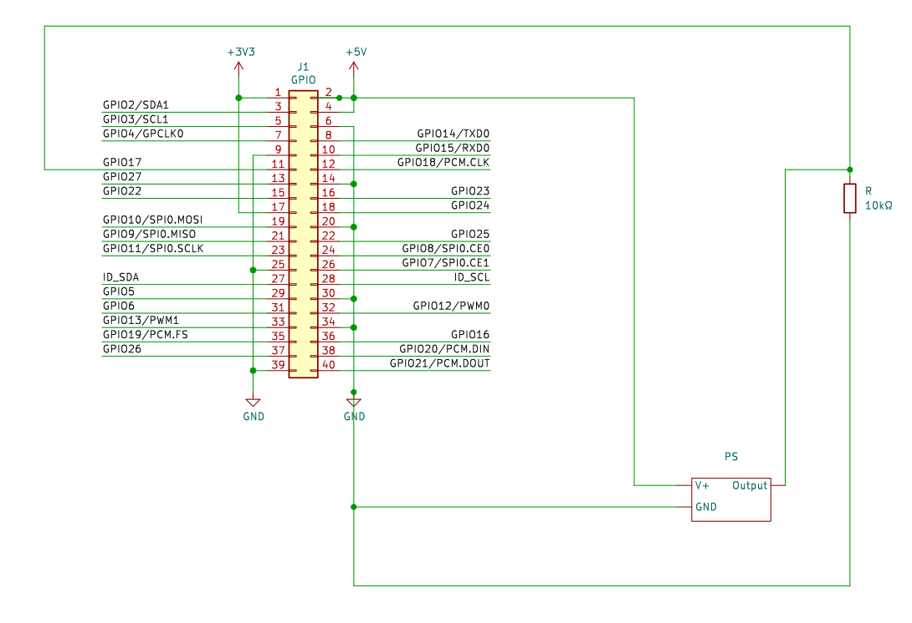
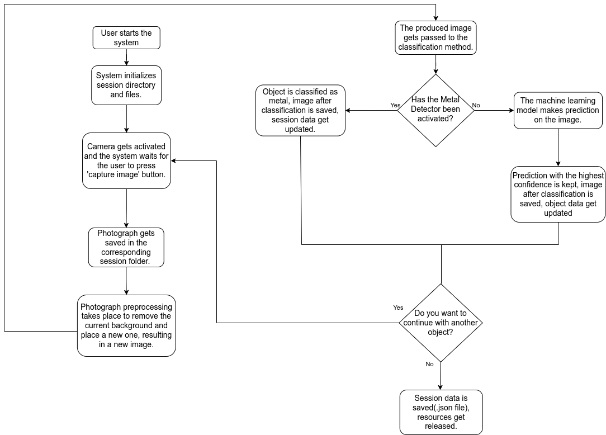

## Hardware wiring

- The camera is connected to the Raspberry Pi via a USB port and is mounted on a tripod to capture a top-down view of the object.

- The Inductive Proximity Sensor is connected to the Raspberry Pi, as illustrated in the following diagram:

## Software workflow

The following schematic indicates the system workflow. The system workflow is implemented in `Main_SystemStreamlit.py` which is called inside `Recycling_Session.py`

